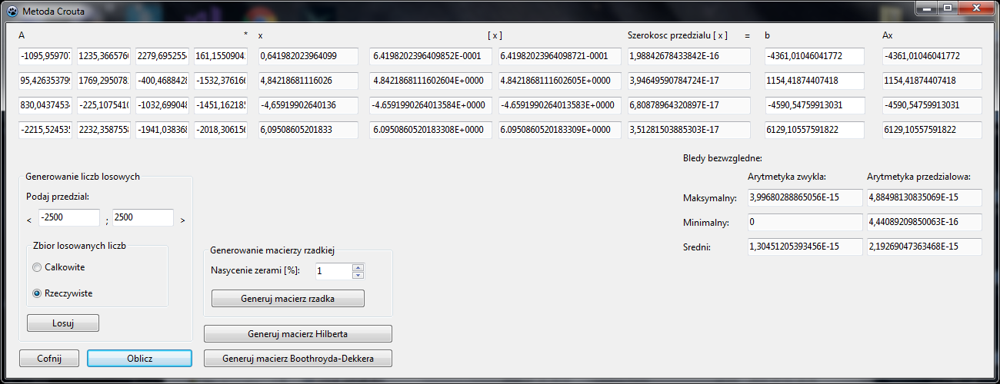

# Interval arithmetics linear equations solver using Crout matrix decomposition

Linear equations solver using Crout decomposition in normal and interval arithmetics. Measures approximation error between results in these two arithmetics. It's able to generate Hilbert and Boothroyd-Dekker matrix.

## Running

Run `crout.exe`.

## Screenshots

